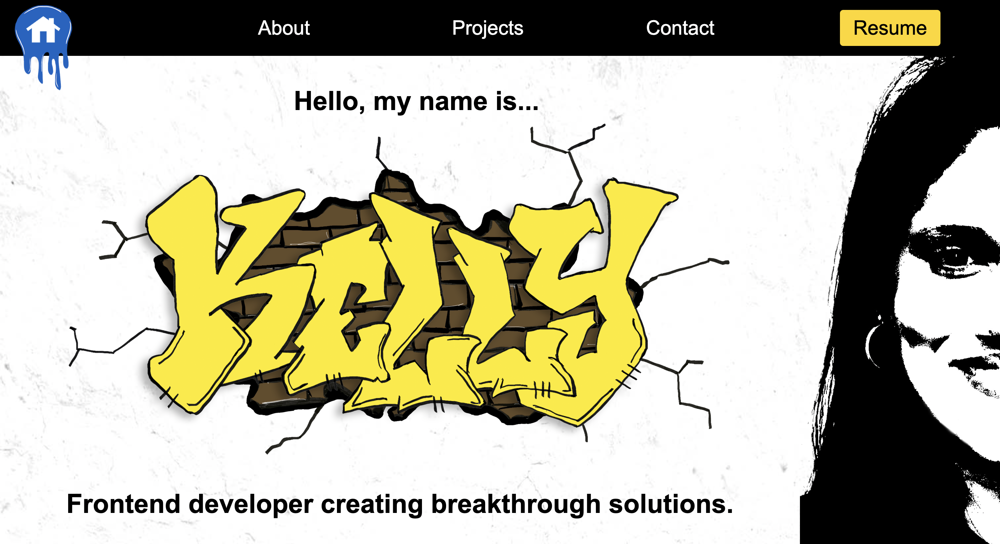

# Portfolio
I designed and built my portfolio to house and showcase several of my designs, websites, and apps. 

**Link to project:** https://codefitness21.github.io/Portfolio/
## How It's Made:
**Tech used:** HTML, SASS, JavaScript, and hand-drawn art design to house some of my favorite and most important projects.

This was my first big coding project that took almost a year to build (September 2022 - June 2023). I began with the wireframing, mock-ups, and color palettes in Adobe XD. I spent about four months perfecting the design before transitioning my work to VSCode. At the time, there were only two projects in my portfolio, so it was pretty easy to build using vanilla code. However, as my skill set improved, I built more projects and realized it was a bit challenging to manage. I wasn't familiar with how to use frameworks at the time, which, in retrospect, would have simplified  its maintenance. 

## Lessons Learned:
After learning Vue, my goal is to rebuild and optimize my portfolio in Vue so it's much easier to manage, using components and view pages. My portfolio has grown exponentially from two to nine projects and counting. If this were a simple single-page site, then vanilla code would have sufficed. However, any large project will always be built using a framework.

## Examples:
Check out some of my other work that I have in my portfolio:

**Bamboo Village Books:** https://www.bamboovillagebooks.com/

**Extrahands:** https://main.d1aa7jmphrn7j7.amplifyapp.com/

**Sports Betting:** https://codefitness21.github.io/Sports-Betting-App/

